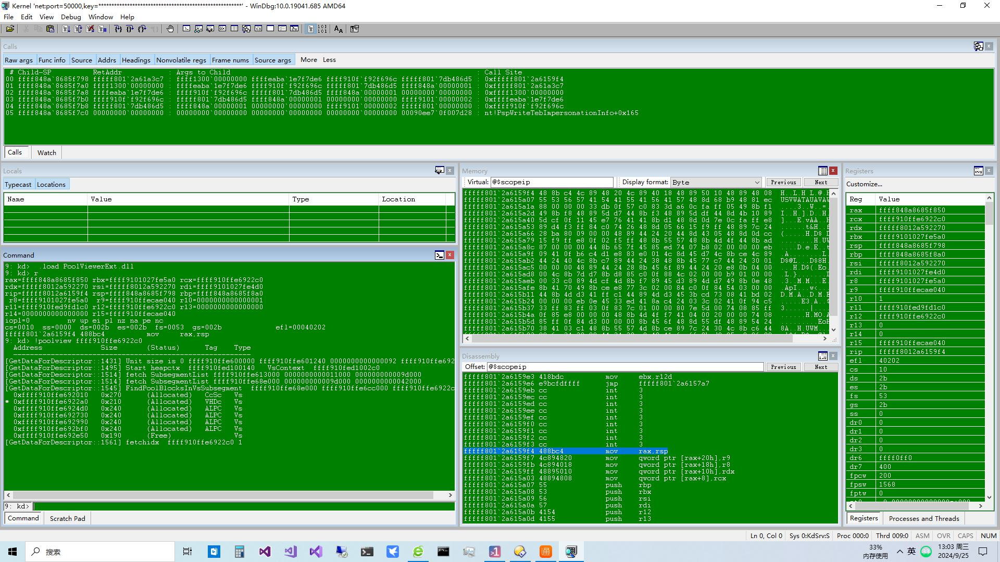

# Win11PoolView

test on win11 24h2 support lastest preview version

```
9: kd>  .load PoolViewerExt.dll
9: kd> r
rax=ffff848a8685f850 rbx=ffff9101027fe5a0 rcx=ffff910ffe6922c0
rdx=fffff8012a592270 rsi=fffff8012a592270 rdi=ffff9101027fe4d0
rip=fffff8012a6159f4 rsp=ffff848a8685f798 rbp=ffff848a8685f8a0
 r8=ffff9101027fe5a0  r9=ffff910ffecae040 r10=0000000000000001
r11=ffff910fed9fd1c0 r12=ffff910ffe6922c0 r13=0000000000000000
r14=0000000000000000 r15=ffff910ffecae040
iopl=0         nv up ei pl nz na pe nc
cs=0010  ss=0000  ds=002b  es=002b  fs=0053  gs=002b             efl=00040202
fffff801`2a6159f4 488bc4          mov     rax,rsp
9: kd> !poolview ffff910ffe6922c0
  Address              Size       (Status)      Tag    Type
  ---------------------------------------------------------
[GetDataForDescriptor::1431] Unit size is 0 ffff910ffe600000 ffff910ffe601240 0000000000000092 ffff910ffe6922c0
[GetDataForDescriptor::1495] Start heapctx  ffff910fed100140   VsContext  ffff910fed1002c0 
[GetDataForDescriptor::1514] fetch SubsegmentList ffff910ffe613000 0000000000011000 000000000009d000 
[GetDataForDescriptor::1514] fetch SubsegmentList ffff910ffe68e000 000000000009d000 0000000000042000 
[GetDataForDescriptor::1545] FindPoolBlocksInVsSubsegment  ffff910ffe68e000 ffff910ffe6cc000 ffff910ffe6922c0 
  0xffff910ffe692010   0x270      (Allocated)   CcSc   Vs
* 0xffff910ffe6922a0   0x210      (Allocated)   VHDc   Vs
  0xffff910ffe6924d0   0x240      (Allocated)   ALPC   Vs
  0xffff910ffe692730   0x240      (Allocated)   ALPC   Vs
  0xffff910ffe692990   0x240      (Allocated)   ALPC   Vs
  0xffff910ffe692bf0   0x240      (Allocated)   ALPC   Vs
  0xffff910ffe692e50   0x190      (Free)               Vs
[GetDataForDescriptor::1561] fetchidx  ffff910ffe6922c0 1 

```


